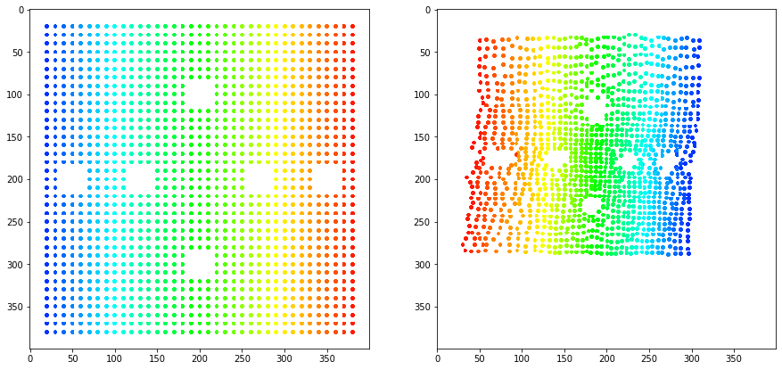
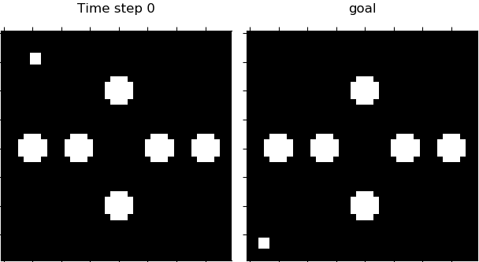
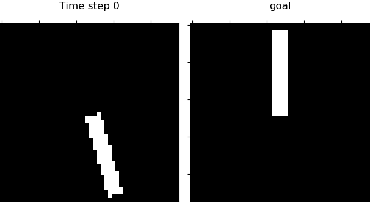
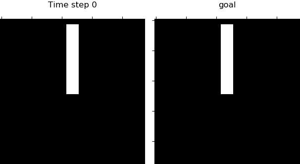

## Prediction, Consistency and Curvature

This is a pytorch implementation of the paper "[Prediction, Consistency, Curvature: Representation Learning for Locally-Linear Control](https://arxiv.org/abs/1909.01506)".

**Note: This is not the official implementation.**

## Installing

First, clone the repository:

```
git clone https://github.com/tungnd1705/PCC-pytorch.git
```

Then install the dependencies as listed in `pcc.yml` and activate the environment:

```
conda env create -f pcc.yml

conda activate pcc
```

## Training

The code currently supports training for ``planar`` and ``pendulum`` environment. Run the ``train_pcc.py`` with your own settings. For example:

```
python train_pcc.py \
    --env=planar \
    --armotized=False \
    --log_dir=planar_1 \
    --seed=1 \
    --data_size = 5000 \
    --noise = 0 \
    --batch_size=128 \
    --lam_p=1.0 \
    --lam_c=8.0 \
    --lam_cur=8.0 \
    --vae_coeff=0.01 \
    --determ_coeff=0.3 \
    --lr=0.0005 \
    --decay=0.001 \
    --num_iter=5000 \
    --iter_save=1000 \
    --save_map=True
```

First, data is sampled according to the given data size and noise level, then PCC model will be trained using the specified settings.

If the argument save_map is set to True, the latent map will be drawn every 10 epoches, then the gif file will be saved at the  same directory as the trained model.

You can also visualize the training process by running ``tensorboard --logdir={path_to_log_file}``, where ``path_to_log_file`` has the form ``logs/{env}/{log_dir}``. The trained model will be saved at ``result/{env}/{log_dir}``.

## Sampling data

You can generate the training images for visualization by simply running:

```
cd data

python sample_{env_name}_data.py --sample_size={sample_size} --noise={noise}
```

Currently the code supports simulating 3 environments: `planar`, `pendulum` and `cartpole`. The MDP for `pendulum` and `cartpole` is borrowed from Yinlam's code.

The raw data (images) is saved in data/{env_name}/raw\_{noise}\_noise
<!-- For the planar task, we base on [this](https://github.com/ethanluoyc/e2c-pytorch) implementation and modify for our needs. -->

## Running iLQR on latent space

The configuration file for running iLQR for each task is in ``ilqr_config`` folder, you can modify with your own settings. Run ``python ilqr.py --task={task}``, where ``task`` is in ``{plane, swing, balance}``.

The code will run iLQR for all models trained for that specific task and compute some statistics. The result is saved in ``iLQR/result``.

## Result
We evaluate the PCC model in 2 ways: quality of the latent map and the percentage of time the agent spent in the goal region.
### Planar system

#### Latent map
Below is a random latent map PCC produces. You can watch a video clip comparing how latent maps produced by E2C and PCC evolve at this link: https://www.youtube.com/watch?v=pBmzFvvE2bo.



#### Control result
We got around 41% on average and around 76% for the best model. Below are 2 sample trajectories of the agent.




### Inverted pendulum
We got around 51% on average and around 86.4% for the best model. Below are 2 sample trajectories of the inverted pendulum.




### Acknowledgment
Many thanks to Nir Levine for answering my questions about the paper, and Yinlam Chow for the MDP and iLQR implementation.

### Citation

If you find PCC useful in your research, please consider citing:

```
@techreport{48535,
title	= {Prediction, Consistency, Curvature: Representation Learning for Locally-Linear Control},
author	= {Nir Levine and Yinlam Chow and Rui Shu and Ang Li and Mohammad Ghavamzadeh and Hung Bui},
year	= {2019}
}
```